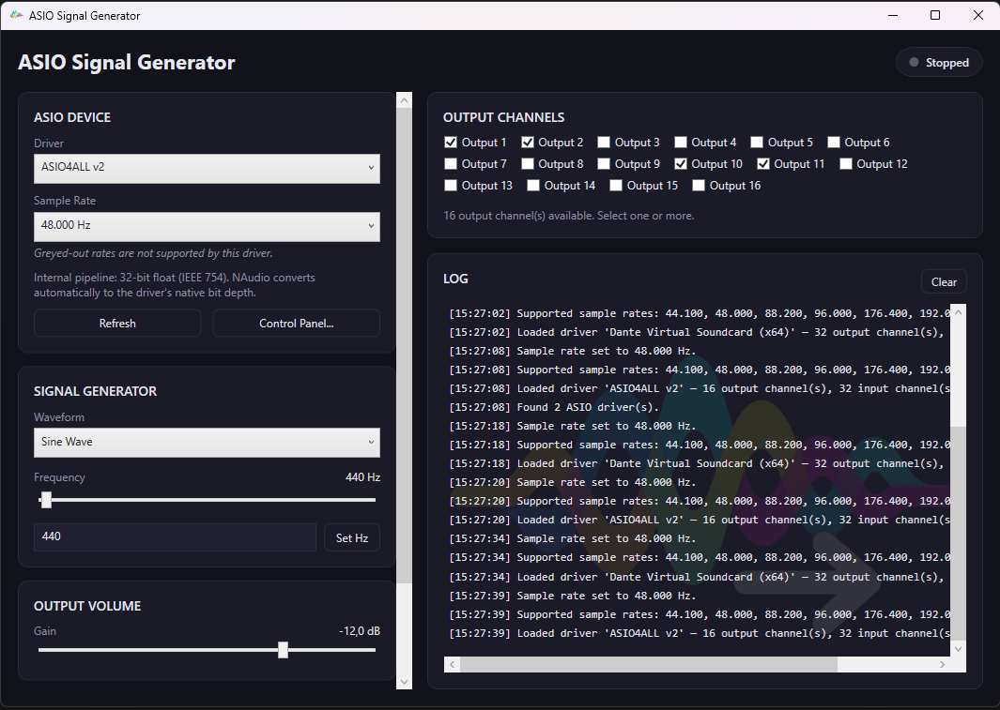

# ASIO Signal Generator



A small Windows WPF (.NET 8) app that uses NAudio to generate basic test signals and send them to any ASIO output device. It provides device and sample-rate selection, simple waveform choice, per-channel routing and dB gain control.

## Quick features

- ASIO device and sample-rate selection with live validation
- Basic waveforms: Sine, Square, Triangle, Sawtooth, White Noise, Pink Noise
- Per-channel routing and live gain (in dB)
- Start / Stop transport and a live activity log

## Requirements

- Windows (WPF + ASIO)
- [.NET 8 SDK](https://dotnet.microsoft.com/download)
- An ASIO driver (e.g. ASIO4ALL)

## Build & run

Using Visual Studio: open `AsioSignalGenerator.sln` and run.

Command line:

```bash
cd AsioSignalGenerator
dotnet restore
dotnet build -c Release
dotnet run -c Release
```

## Notes

The internal audio pipeline uses 32-bit float. When rendering/exporting to WAV (via NAudio) common wave file formats are 16-bit PCM, 24-bit PCM and 32-bit float.
